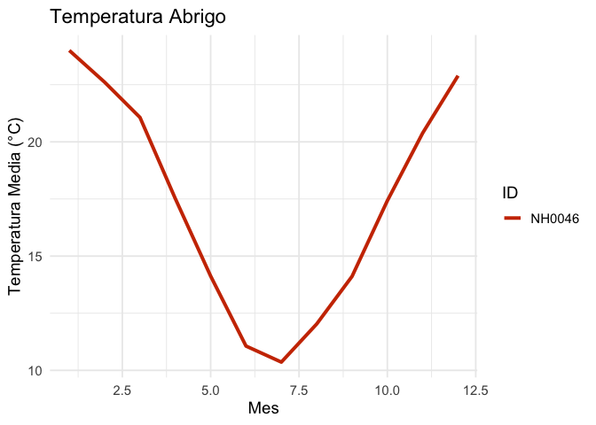

<!-- README.md is generated from README.Rmd. Please edit that file -->

# PaqueteAgrometeorologico


<!-- badges: start -->

[](https://lifecycle.r-lib.org/articles/stages.html#experimental)
[](https://github.com/juaniii29/PaqueteDatosMeteorologicos/actions/workflows/R-CMD-check.yaml)
[](https://app.codecov.io/gh/juaniii29/PaqueteDatosMeteorologicos)
<!-- badges: end -->

El objetivo del PaqueteDatosMeteorologicos es brindar herramientas al
usuario en base a funciones, para que pueda trabajar de manera mas
eficiente en el ambito meteorologico.

## Instalacion

Puedes instalar la versión de desarrollo de PaqueteDatosMeteorologicos
desde [GitHub](https://github.com/) con:

``` r
# install.packages("pak")
pak::pak("juaniii29/PaqueteDatosMeteorologicos")
```

## Funciones

*`convertir_cf()`*: Toma un valor numerico en grados celsius y lo
convierte a grados fahrenheit.

*`convertir_fc()`*: Toma un valor numerico en grados fahrenheit y lo
convierte a grados celsius.

*`clasificar_temperatura()`*: Toma un valor numerico en grados celsius y
lo clasifica dependiendo de su magnitud.

*`tabla_resumen_temperatura()`*: Toma un dataset con informacion sobre
estaciones meteorologicas y devuelve un resumen. sobre este.

*`grafico_temperatura()`*: Toma un dataset con informacion sobre
estaciones meteorologicas y devuelve un grafico de la temperatura media
mensual por estación.

## Example

Este es un ejemplo basico en el que se muestra una de las tantas
funciones del paquete:

``` r
devtools::load_all(".")
#> ℹ Loading PaqueteDatosMeteorologicos
#> Rows: 258 Columns: 11
#> ── Column specification ────────────────────────────────────────────────────────
#> Delimiter: ","
#> chr (8): id, nombre, tipo, localidad, provincia, ubicacion, desde, hasta
#> dbl (3): lat, lon, altura
#> 
#> ℹ Use `spec()` to retrieve the full column specification for this data.
#> ℹ Specify the column types or set `show_col_types = FALSE` to quiet this message.
convertir_fc(c(0, 32, 100))
#> [1] -17.77778   0.00000  37.77778
```

``` r
tabla_resumen_temperatura('NH0910')
#> # A tibble: 1 × 4
#>   promedio_temperatura desviacion_estandar minima maxima
#>                  <dbl>               <dbl>  <dbl>  <dbl>
#> 1                 17.7                6.12   -8.5     43
```

``` r
grafico_temperatura(NH0046)
```



### Autores

\[Juan Ignacio Castillo\] (<https://github.com/juaniii29>) Estudiante de
la licenciatura en Ciencia de Datos \[Santino Almiron Nanni\]
(<https://github.com/santialmironn>) Estudiante de la licenciatura en
Ciencia de Datos
